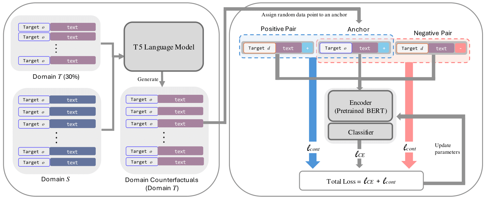

# Robust Stance Detection: Understanding Public Perceptions in Social Media
Implementation of the ASONAM'24 paper: Robust Stance Detection: Understanding Public Perceptions in Social Media

<p align=center>


## Code usage
The code is written in Python. To use the code:

[1] Install the requirements using the following command:
```bash
pip install -r requirements.txt
```

[2] Use the following commands to train and test the model:
```bash
### Train
python finetune.py --mode train --dataset ${TRAIN_DATA} --lr 2e-5 --batch_size 4 --epochs 2 --alpha 0.5 --beta 0.1 --num_pair 50 --num_label 2

### Test
python finetune.py --mode test --dataset ${TEST_DATA} --num_label 2
```

[3] For the dataset, please reach out to the authors. Due to X's policy, we cannot publically share the dataset, but it will be available upon request.

### Python packages version
* matplotlib==3.5.1
* numpy==1.24.4
* pandas==1.4.2
* scikit_learn==1.0.2
* torch==1.12.0
* transformers==4.34.0

### Reference
> [Nayoung Kim](https://nayoungkim94.github.io/), [Ahmadreza Mosallanezhad](https://davood-m.github.io), Lu Cheng, Michelle V. Mancenido, and [Huan Liu](http://www.public.asu.edu/~huanliu/). ** Robust Stance Detection: Understanding Public Perceptions in Social Media **_Advances in Social Network Analysis and Mining 2024_ASONAM 2024, 2024.
